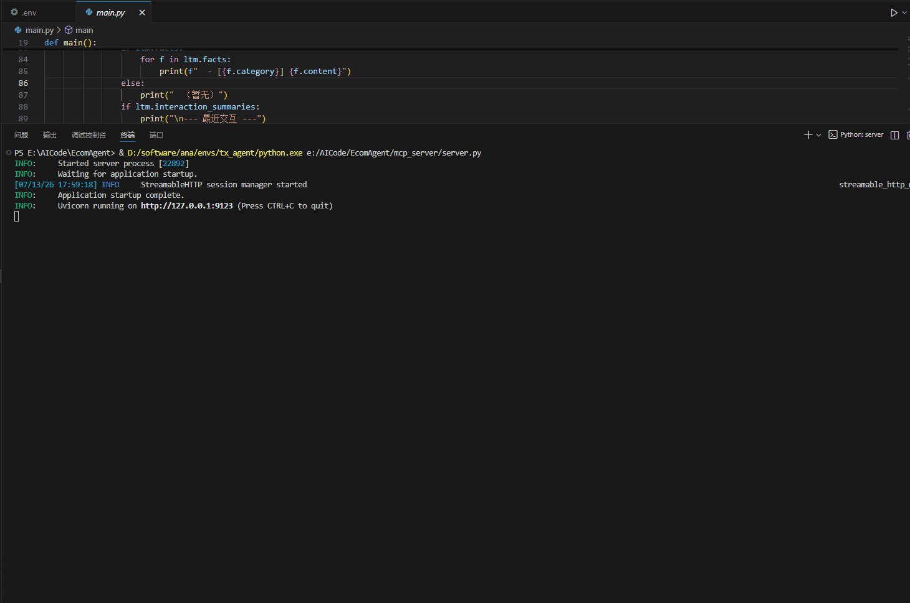
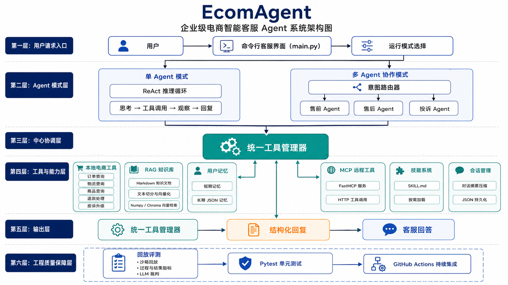

# EcomAgent｜电商智能客服 Agent

[](https://github.com/dingsleep/EcomAgent/actions/workflows/ci.yml)

面向“云商城”场景的企业级电商智能客服 Agent。项目以 **ReAct 工具调用** 为核心，结合 RAG、MCP、多 Agent 协作、用户记忆、技能编排与可回放评测，完成订单、物流、商品、退款和投诉升级等客服闭环。

> 订单、商品和物流信息均为 Mock 数据。本项目用于展示 Agent 编排与工程化能力，不连接真实交易系统。



## 项目亮点

- **双 Agent 模式**：支持单 Agent 直连处理，也支持路由器分派给售前、售后和投诉专家 Agent。
- **可靠工具调用**：订单、物流、政策、退款状态等高频问题优先走确定性快速路径；投诉可调用升级工具形成闭环。
- **RAG 知识检索**：Markdown 知识库经切分和向量化后，支持 Numpy（零额外服务）与 Chroma 两种检索后端。
- **多层上下文管理**：短期记忆抽取、长期 JSON 记忆、会话持久化与历史摘要压缩协同工作。
- **MCP 兼容与降级**：本地工具与 FastMCP 远程工具统一注册；远程服务不可达时自动降级到本地工具。
- **可验证工程质量**：提供沙箱回放、过程/结果指标、LLM-as-Judge 评测，以及 Pytest 分层测试和 GitHub Actions CI。

## 架构概览



```text
用户 → CLI（main.py） → 单 Agent / 多 Agent 编排 → 统一工具管理器 → 结构化客服回复
                                                   ├─ 本地电商工具
                                                   ├─ MCP 远程工具
                                                   ├─ RAG 知识库
                                                   ├─ 用户记忆与会话管理
                                                   └─ SKILL.md 技能系统

回放评测 + Pytest + GitHub Actions CI 为全链路提供质量保障
```

## 核心能力

| 能力 | 实现方式 |
| --- | --- |
| Agent 推理 | ReAct：思考 → 工具调用 → 观察 → 回复 |
| 工具调用 | OpenAI Function Calling；本地与 MCP 双通道 |
| 多 Agent | 意图路由 + 售前 / 售后 / 投诉子 Agent + 工具白名单 |
| 知识检索 | Markdown 知识库 + Embedding + Numpy / Chroma 向量检索 |
| 记忆系统 | 会话内短期记忆 + 跨会话 JSON 长期记忆 |
| 技能系统 | Agent Skills 标准，按需加载 `SKILL.md` 指令 |
| 对话管理 | 历史摘要压缩与会话 JSON 持久化 |
| 评测体系 | 沙箱回放、工具调用忠实度、结果指标、LLM-as-Judge |

## 快速开始

### 1. 安装依赖

```bash
pip install -r requirements.txt
```

如需运行单元测试：

```bash
pip install -r requirements-dev.txt
```

### 2. 配置模型

```bash
# macOS / Linux
cp .env.example .env

# PowerShell
Copy-Item .env.example .env
```

编辑 `.env`，至少填写：

```env
OPENAI_API_KEY=your-api-key
OPENAI_BASE_URL=https://api.openai.com/v1
MODEL_NAME=gpt-4o-mini
```

### 3. 构建知识库索引并启动

```bash
python -m app.scripts.build_kb_index
python main.py
```

命令行中可输入 `quit` / `exit` 退出，`reset` 重置会话，`memory` 查看记忆，`skills` 查看可用技能。

## 运行模式

### 单 Agent 模式（默认）

```bash
python main.py
```

单个 `EcomAgent` 持有完整工具集，根据问题自行决定是否检索知识库、调用工具或读取记忆。

### 多 Agent 协作模式

在 `.env` 设置：

```env
MULTI_AGENT_ENABLED=true
```

系统会先进行意图路由，再分派到售前、售后或投诉 Agent。子 Agent 通过工具白名单隔离能力，例如投诉 Agent 无法执行退款申请。

### MCP 模式（可选）

终端一启动 MCP Server：

```bash
python mcp_server/server.py
```

终端二在 `.env` 启用 MCP 后启动 Agent：

```env
MCP_ENABLED=true
```

```bash
python main.py
```

MCP 服务未启动时，系统会提示连接失败并继续使用本地工具；这不会阻塞本地演示和单元测试。

## 测试与评测

### 离线单元测试

```bash
python -m pytest -m unit -q
```

当前离线单元测试覆盖快速路径、退款确认、投诉升级、评测指标与 MCP 降级等关键行为，无需有效模型 Key，也不会请求模型接口。

### 完整测试集

```bash
python -m pytest tests/ -v
```

部分端到端测试依赖有效模型配置。

### 构建检查

```bash
python -m compileall app mcp_server
```

### 回放评测

```bash
# 仅运行确定性代码指标
python -m app.scripts.run_eval --no-judge

# 单 Agent：包含 LLM 裁判
python -m app.scripts.run_eval

# 多 Agent：包含 LLM 裁判
python -m app.scripts.run_eval --mode multi
```

本轮 10 条多 Agent 场景回放评测全部通过；快速路径上线后，相比原始 Agent 工具链路，平均 token 消耗下降约 89%。评测结果会受模型、提示词和数据集变化影响，建议在本地配置模型后复现。

## 项目结构

```text
main.py                         # CLI 入口，切换单/多 Agent 模式
app/
├── agent/                      # ReAct Agent、工具、RAG、记忆、技能
├── multi_agent/                # 路由器、子 Agent、编排器
├── mcp_client/                 # MCP 客户端与工具 Schema 转换
├── evaluation/                 # 回放评测、指标与数据集
├── prompts/                    # Agent、摘要、评测提示词
├── schemas/                    # Pydantic 结构化输出
├── config/                     # Pydantic Settings 配置
└── scripts/                    # 构建知识库、运行评测脚本
mcp_server/                     # FastMCP 独立服务
tests/                          # 分主题测试与 unit 标记
docs/                           # 架构图与终端演示素材
```

## 技术栈

Python 3.10+ · OpenAI-compatible API · OpenAI Function Calling · Pydantic · FastMCP · Numpy / Chroma · Pytest · GitHub Actions

## License

MIT
